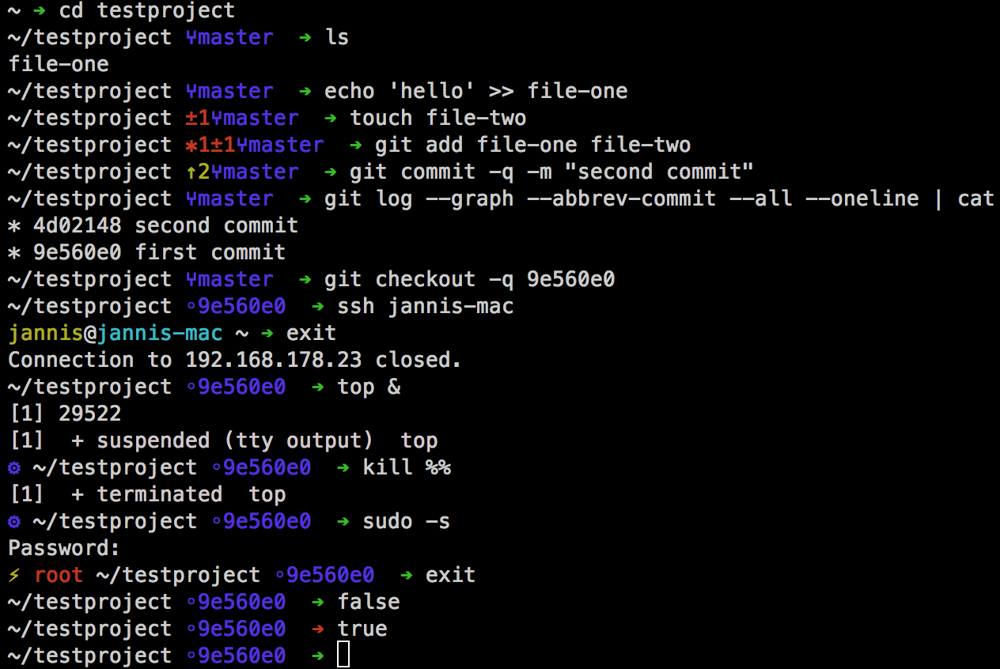
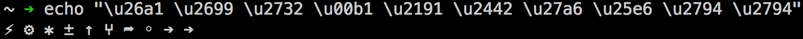

# Vibrant ZSH theme



A minimalistic but colorful [ZSH](http://www.zsh.org/) theme made to **show you *only relevant* information** in an unobtrusive way.

*vibrant* is works well with [Oh My ZSH](http://ohmyz.sh/), [Git](http://git-scm.com/) and Unicode fonts. It is heavily inspired by [*agnoster*'s ZSH theme](https://gist.github.com/agnoster/3712874).


## Features

- *vibrant* shows only the current and one parent directory.
- **In a [git](http://git-scm.com/) repository**, it shows you the **branch** and the number of **untracked, unstaged and staged files**.
- The number of background jobs is shown.
- *vibrant* warns priveleged users (e.g. `root`).
- If the last command exited non-zero, the prompt arrow changes red.


## Compatibility

By default, *vibrant* uses the following Unicode characters:

```shell
echo "\u26a1 \u2699 \u2732 \u00b1 \u2191 \u2442 \u25e6 \u2794 \u2794"
```

They should look like the following:

```
⚡ ⚙ ✲ ± ↑ ⑂ ◦ ➔ ➔
```

In `Terminal.app` on OS X Mavericks using the font `Menlo`, they look like this:




## License

This theme is licensed under the [MIT License](LICENSE).


## Contributing

If you **have a question**, **found a bug** or want to **propose a feature**, have a look at [the issues page](https://github.com/derhuerst/vibrant-zsh-theme/issues).
